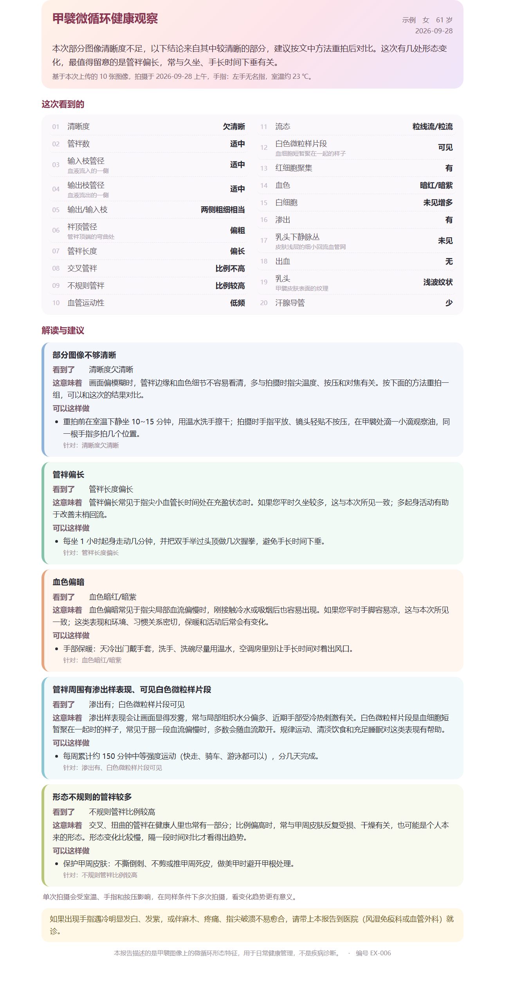

# 甲襞微循环图像分析 · expert-router-final

输入：同一次检查拍摄的若干张静态甲襞显微图像（jpg/png/bmp/tif）。

输出：
- 一份 20 项结构化观察（JSON）。
- 一页面向用户的健康观察卡（HTML）。卡片里有按识别结果组合的差异化生活建议。

本地运行即可，不依赖大模型，不需要联网。定位是日常健康管理，不是医疗器械，不做疾病诊断。



上图是开发集一例的实际输出，姓名、年龄为示例值。其余 8 例的 JSON 见 [release/final_v1/examples/](release/final_v1/examples/)。

---

## 1. 快速开始

```bash
pip install -r release/final_v1/requirements.txt
pip install -e .
```

scikit-learn 必须是 1.9.0，因为分类头是 pickle 的 sklearn 管线，换版本加载会失败或结果漂移。

模型二进制不在 git 里（体积大）。把下面 5 个文件放到对应路径即可，加载时会逐个校验 sha256，不匹配直接报 `AssetMismatch`：

| 路径 | 大小 | sha256 |
|---|---|---|
| `artifacts/models/expert_router_v1/bundle.joblib` | 19.8 MB | `04ee6b80…b17241` |
| `artifacts/models/expert_router_v1/seg_s0.pt` | 43.1 MB | `08103c92…66838bb` |
| `artifacts/models/expert_router_v1/det_capillary.pt` | 18.3 MB | `0ca4c3bb…823888f` |
| `weights/dinov2/b/model.safetensors` | 330 MB | `55cbb5d8…35886d8c7b` |
| `artifacts/models/rag_heads_v1/bundle.joblib` | 7.4 MB | 只读取其中的编码器预处理配置 |

完整 sha256 见 [release/final_v1/release_manifest.json](release/final_v1/release_manifest.json)。文件请向项目负责人索取。

### 1.1 Python 调用

```python
from pathlib import Path
from nailfold_report.final_inference import FinalReportPredictor
from nailfold_report.final_render import render_html, thumbnail_bytes

ROOT = Path(r"E:\甲劈微循环")            # 仓库根目录
p = FinalReportPredictor(ROOT, device="cpu")   # 或 "cuda:0"
paths = sorted(Path("某次检查").glob("*.jpg"))
report = p.predict(paths, exam_id="E001", device_id="unknown")   # dict，结构见 §3
render_html(report, "report.html",
            patient={"name": "张三", "sex": "女", "age": "52", "exam_date": "2026-09-28",
                     "capture_time": "上午", "finger": "左手无名指", "room_temp": "23"},
            images=thumbnail_bytes(paths))
```

在 CPU 上每张图约需 5~10 秒。一次检查通常有 8~10 张图，约 1 分钟；GPU 上是秒级。

### 1.2 HTTP 服务

```bash
uvicorn nailfold_report.final_api:app --host 127.0.0.1 --port 8000
```

> ⚠️ 接口没有任何鉴权，也没有限流。只能绑定 127.0.0.1，或放在平台网关后面，由网关负责认证。不要直接暴露到公网。

| 方法 | 路径 | 说明 |
|---|---|---|
| GET | `/` | 本地测试上传页 |
| GET | `/v1/health` | 返回 release_id 和 4 个模型文件的 sha256，可用于探活和版本核对 |
| POST | `/v1/reports` | multipart 表单，默认返回 JSON；加 `?format=html` 返回健康观察卡 HTML |
| GET | `/examples/{n}` | 示例报告 HTML，n = 1..8，需先运行 `scripts/make_final_examples.py` 生成 |

`POST /v1/reports` 的表单字段：

| 字段 | 必填 | 说明 |
|---|---|---|
| `exam_id` | 是 | 1~128 字符，原样写回报告 |
| `device_id` | 否 | 默认 `unknown` |
| `finger` | 否 | 左手无名指 / 右手无名指 / 左手中指 / 右手中指 / 其他，只用于 HTML 抬头 |
| `room_temp` | 否 | 0~45 的整数（℃），只用于 HTML 抬头 |
| `images` | 是 | 1~64 张，单张 ≤ 20 MB，扩展名 jpg/jpeg/png/bmp/tif/tiff |

错误码：
- 422：张数不对，或图像无法解码。
- 415：扩展名不支持。
- 413：单张超过 20 MB。

服务端不信任客户端文件名，图像只写到临时目录，请求结束即删除。

```bash
curl -F exam_id=E001 -F images=@1.jpg -F images=@2.jpg http://127.0.0.1:8000/v1/reports
```

环境变量：
- `NAILFOLD_ROOT`：仓库根目录，默认按包位置推断。
- `NAILFOLD_DEVICE`：`cpu` 或 `cuda:0`，默认 cpu。

---

## 2. 模型怎么工作

```
图像 ──┬─ A0  DINOv2-B 图像特征（5 种池化 → PCA64）
       ├─ COL 颜色 / 清晰度 / 背景统计（6 个区域）
       ├─ SEG S0 YOLO 分割器 → 每根管袢的几何与拓扑
       └─ DET Capillary-Dataset 检测器 → bushy/crossing/hairpin/tortuous 计数与比例
                 │ 每路按病例取均值
                 ▼
   13 个二分类目标 × 4 个 LogReg 头（C=0.03）
                 │ 四个概率取平均 p
                 ▼
   Platt 校准 q = σ(a·logit p + b)，判定 q > 0.5
                 ▼
   20 行观察（二分类 / 三档 / 乳头 / 固定 / 派生） → 模板建议 → JSON / HTML
```

- 同一套路由用于所有字段，没有逐字段挑模型。逐字段挑选在实验里是负收益，详见 §5。
- 三档行（输入枝、输出枝、袢顶管径、管袢长度）由"偏低"和"偏高"两个单侧头组合：P(适中) = 1 − P(低) − P(高)，取 argmax。
- 乳头由"平坦""波纹状"两个头组合，得到平坦 / 浅波纹状 / 波纹状三档。
- 4 行固定输出：血管运动性、白细胞、出血、汗腺导管。开发集中 85~97% 的病例是同一个答案，这几行不看图，直接输出该答案。
- 1 行派生：输出/输入枝，由两枝的档位组合出措辞，不做除法。
- 输出不含任何尺寸、计数、频次、积分或严重度分级。

### 建议是怎么生成的（模板检索，非 LLM）

代码在 `src/nailfold_report/final_advice.py`。

1. 偏离行按含义归入 5 个主题：
   - 拍摄（清晰度）
   - 末梢偏凉（管径偏细、血色暗、管袢少）
   - 回流偏慢（管径偏粗、管袢偏长）
   - 形态（交叉、畸形、管袢偏短）
   - 局部环境（渗出、白色微粒样片段）

   没有偏离时输出"保持"主题。
2. 一行只有同时满足两个条件才触发建议：结果偏离常见答案，且校准概率离 0.5 足够远（等级 ≥ 中等）。流态和红细胞聚集永不触发建议。
3. 主题按触发行的概率排序，拍摄主题固定排第一：图不清时先让用户重拍。每个主题包含三部分：
   - 这次看到了什么（seen）
   - 这意味着什么（meaning）
   - 可以这样做（actions）
4. 全篇最多 5 条行动建议。各主题轮流分配，不重复。每条都标注"针对：xx"，说明它对应哪条发现。
5. 用词有禁词表（`final_registry.FORBIDDEN`，测试会逐条检查），例如"诊断为""药物""把握""参考范围""模型"，以及单位 µm、条/mm 等。

在全部 233 例上跑下来，建议有 54 种主题组合、61 种行动清单、30 种开头语，不同病例的建议会不同。

---

## 3. 输出 JSON

完整 schema 见 [release/final_v1/schemas/report.schema.json](release/final_v1/schemas/report.schema.json)。

```jsonc
{
  "schema_version": "nailfold-report/2.0",
  "release_id": "expert-router-final",
  "exam_id": "E001",
  "images": 9,
  "assets": {"bundle_sha256": "…", "encoder_sha256": "…", "seg_sha256": "…", "det_sha256": "…"},
  "device": {"id": "unknown"},
  "fields": {                       // 固定 20 个 key，顺序同病例报告单
    "clarity": {
      "item": "清晰度", "kind": "binary",       // binary | band3 | papilla | fixed | derived
      "value": "欠清晰", "reference": "清晰",    // reference = 常见答案
      "deviates": true,                          // value 是否偏离常见答案
      "probability": 0.645, "confidence": 1,     // 0 较低 / 1 中等 / 2 较高（fixed 行为 null）
      "class_id": 1, "class_probabilities": [0.355, 0.645]
    },
    "…": {}
  },
  "advice": {
    "headline": "…",
    "sections": [{"theme": "photo", "title": "…", "triggers": ["clarity"],
                  "seen": "…", "meaning": "…", "actions": [{"text": "…", "for": "…"}]}],
    "how_to_read": "…", "see_doctor": "…", "disclaimer": "…", "generated_by": "template"
  },
  "audit": {"clarity": {"p": 0.61, "q": 0.645, "parts": {"A0": …, "COL": …, "SEG": …, "DET": …}}}
}
```

20 个字段 key：

`clarity, capillary_count, afferent_diameter, efferent_diameter, output_input_ratio, apex_diameter, loop_length, crossing_ratio, malformation_ratio, flow_state, vasomotion, rbc_aggregation, wbc_count, microthrombus, blood_color, exudation, hemorrhage, subpapillary_venous_plexus, papilla, sweat_duct`

每个字段的中文名、可能取值和常见答案定义在 `src/nailfold_report/final_registry.py` 的 `FIELDS` 里。

接入时的注意点：
- `audit` 是给开发和排查用的逐专家概率，不要展示给终端用户。
- HTML 页面刻意不显示 `probability`、`confidence`、`reference`。如果接入方自己渲染页面，请保持这一点。

---

## 4. 效果

口径：
- 233 例有标签病例，病人级 5 折交叉验证。校准器在每个外层训练集内部再做 5 折 OOF 拟合，外层测试折不参与任何拟合。
- 对照组是"每例都答训练集最常见答案"。
- Δ 是准确率差的配对 bootstrap 95% 置信区间。

数字来自 [calibrated_router.json](artifacts/experiments/expert_routes_20260928/calibrated_router.json)。

| 观察项 | n | 准确率 | 常见答案 | Δ 95% CI | 平衡准确率 | AUROC |
|---|---|---|---|---|---|---|
| 清晰度 | 231 | 0.814 | 0.524 | [+0.208, +0.368] | 0.814 | 0.874 |
| 乳头下静脉丛 | 231 | 0.775 | 0.589 | [+0.113, +0.260] | 0.763 | 0.818 |
| 渗出 | 230 | 0.752 | 0.474 | [+0.196, +0.361] | 0.752 | 0.786 |
| 血色 | 225 | 0.751 | 0.547 | [+0.129, +0.289] | 0.747 | 0.831 |
| 白色微粒样片段 | 228 | 0.715 | 0.605 | [+0.040, +0.180] | 0.687 | 0.770 |
| 不规则管袢 | 201 | 0.657 | 0.547 | [+0.025, +0.199] | 0.649 | 0.719 |
| 管袢数 | 228 | 0.741 | 0.684 | [+0.004, +0.114] | 0.643 | 0.735 |
| 管袢长度（三档） | 221 | 0.575 | 0.507 | [+0.005, +0.131] | 0.487 | — |
| 袢顶管径（三档） | 213 | 0.549 | 0.413 | [+0.052, +0.216] | 0.428 | — |
| 输出枝管径（三档） | 208 | 0.630 | 0.577 | [+0.005, +0.106] | 0.433 | — |
| 输入枝管径（三档） | 209 | 0.498 | 0.459 | [−0.029, +0.105] | 0.441 | — |
| 乳头（三档） | 231 | 0.459 | 0.416 | [−0.026, +0.113] | 0.432 | — |
| 交叉管袢 | 222 | 0.649 | 0.658 | [−0.045, +0.027] | 0.518 | 0.646 |
| 流态 | 225 | 0.791 | 0.791 | 塌缩为常见答案 | 0.500 | 0.422 |
| 红细胞聚集 | 228 | 0.851 | 0.851 | 塌缩为常见答案 | 0.500 | 0.712 |

其余 5 行：
- 固定行（4 行）：血管运动性、白细胞、出血、汗腺导管。
- 派生行（1 行）：输出/输入枝。

- 10 行的置信区间排除 0，优于常见答案。
- 输入枝、乳头、交叉 3 行和常见答案打平。
- 流态、红细胞聚集 2 行塌缩成常见答案。

这 5 行照常输出，但不参与触发建议。

需要如实告知接入方的局限：
1. 只有内部交叉验证，没有外部验证。这批数据此前做过多轮探索，数字偏乐观。
2. 数据只来自一家机构、一种设备，换设备后表现未知。已有模拟实验表明，逐设备重新定心可以缓解偏移，见 `artifacts/experiments/device_shift_20260926/`。
3. 流态、白色微粒样片段在医生原报告里依赖动态视频观察。本系统只从静态图给出关联判断。
4. 固定行不随图像变化，不能用它排除出血等异常。

---

## 5. 目录对照

| 位置 | 内容 |
|---|---|
| **交付代码** | |
| `src/nailfold_report/final_registry.py` | 20 行定义：中文名、取值、常见答案、置信等级阈值、禁词表、模型 sha256 |
| `src/nailfold_report/final_inference.py` | `FinalReportPredictor`：加载与校验 → 四路特征 → 校准概率 → 20 行 → 组装响应 |
| `src/nailfold_report/expert_features.py` | COL / SEG / DET 三路推理期特征，与训练表逐列一致 |
| `src/nailfold_report/rag_inference.py` | A0 的 DINOv2 编码器与预处理（`FinalReportPredictor` 复用它） |
| `src/nailfold_report/final_advice.py` | 模板建议：主题、触发规则、行动分配、话术 |
| `src/nailfold_report/final_render.py` | 健康观察卡 HTML：显示顺序、小贴士、缩略图 |
| `src/nailfold_report/final_api.py` | FastAPI 服务 |
| **发布物** | |
| `release/final_v1/` | 发布说明、requirements、schema、`validation.json`（逐行指标）、`release_manifest.json`（sha256）、`examples/` |
| `release/final_v1/_superseded_v1_static/` | 上一版静态发布，已不使用，仅存档 |
| `artifacts/models/expert_router_v1/metadata.json` | 训练元数据：每个目标的样本数、校准系数、特征配方（二进制不入库） |
| **训练与评估脚本** | |
| `scripts/eval_fixed_router.py` | 固定四专家路由的 5 折 OOF 概率 |
| `scripts/eval_calibrated_router.py` | 嵌套校准 + 判定规则，产出 §4 的数字 |
| `scripts/eval_router_loao.py` | 留一档案外测（按 3 个数据档案轮流留出） |
| `scripts/eval_ordinal_experts.py` | 三档有序头的对照实验（结论：0/15 行有提升） |
| `scripts/fit_expert_router_final.py` | 在全部 233 例上拟合最终 bundle |
| `scripts/make_final_examples.py` | 端到端核对：实时推理与训练特征表的 \|Δq\| < 0.01；生成示例 |
| `scripts/build_final_release_meta.py` | 重算 `validation.json`、`release_manifest.json` |
| `scripts/extract_*.py` | COL / SEG / DET 特征的原始提取实现，`expert_features.py` 调用它们 |
| **实验记录** | |
| `artifacts/experiments/expert_routes_20260928/` | 最终路由的全部评估输出：OOF、校准、三档、LOAO、有序头对照 |
| `artifacts/experiments/` 其余子目录 | 历次实验结果（json/csv），目录名带日期 |
| **测试** | |
| `tests/test_final_release.py` | 发布契约：20 行齐全、禁词、建议差异化、页面不像病例、低变化行不相邻、API、sha256 |
| `tests/` 其余文件 | 标签解析、前瞻评估脚本、旧版接口 |
| **其他** | |
| `docs/report_example.png` | README 效果图 |
| 根目录零散 `.py` / `.md` | 早期探索脚本和阶段报告，与交付无关，保留作历史 |

跑测试。`tests/test_final_release.py` 需要模型二进制和本地训练特征表，只能在有数据的机器上跑；其余测试不依赖数据：

```bash
PYTHONPATH=src python -m pytest tests -q
```

重新训练需要原始数据，数据不在仓库里，顺序如下：

```bash
python scripts/eval_fixed_router.py
python scripts/eval_calibrated_router.py
python scripts/fit_expert_router_final.py
python scripts/make_final_examples.py
python scripts/build_final_release_meta.py
```

---

## 6. 数据与合规

- 仓库不含任何病例图像、病例报告、姓名或原始标签。
  - `.gitignore` 按扩展名排除所有图像、视频、文档和模型文件。
  - 含真实姓名映射的 `*.local.csv` 不入库。
  - `.env` 里的 API key 不入库。
- 实验 csv 里的 `exam_case_id` 是脱敏编号（形如 `recovered_archive1/23`），不含个人信息。
- 第三方数据的使用情况（商用前需法务确认）：
  - SEG 分割器 S0 的训练集 = 自家血管数据集单血管裁图 + ANFC-THU 的 Roboflow coco 导出版 257 张（`scripts/mendeley_seg_build_base.py`）。
  - ANFC 官方版需签协议且禁止商用；Roboflow 导出版的许可条款需要单独核实。
  - `third_party/`（含 ANFC 官方仓库与协议）不入库。
- DET 检测器在公开的 Capillary-Dataset 人工框上训练（apache-2.0）。
- 前瞻评估另走冻结的 `rag_heads_v2` 影子路径，按预注册执行，本发布不改动它。
